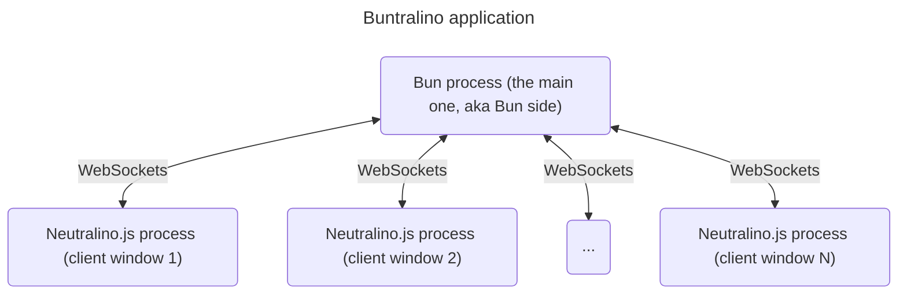

# Buntralino app architecture

The architecture is similar to Electron's main/renderer process model, but uses Bun instead of Node.js and Neutralino instead of Chromium for the UI layer, making it significantly more lightweight.
Buntralino uses two libraries (`buntralino` and `buntralino-client`) to facilitate connection between the main Bun process and Neutralino.js windows.

The Bun side:

- Uses `buntralino` npm package
- Is located in the main process running under [Bun](https://bun.sh/)
- Handles window creation and management through `index.ts` (or another script passed through Buntralino CLI)
- Manages WebSocket connections to Neutralino windows
- Provides a [method registry system](/bun-api.html#method-registration) for exposing Bun-side functionality
- Emits events for window lifecycle management

Client side:

- Uses `buntralino-client` npm package
- Runs in [Neutralino](https://neutralino.js.org/) windows
- Connects to the Bun server via WebSocket
- Provides an API to call registered Bun-side methods
- Handles events and communication with the Bun process

The communication flow works like this:

1. Bun process starts and creates a WebSocket server
2. When a window is created via `buntralino.create()`, it spawns a Neutralino process
3. The Neutralino window connects back to Bun via WebSocket
4. Two-way communication is established:
   - Clients can call registered methods on Bun side
   - Bun can execute JavaScript in the window context
   - Events can be broadcast between windows through the Bun process.